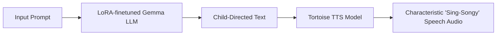
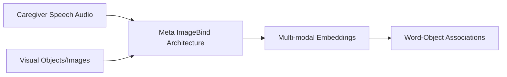
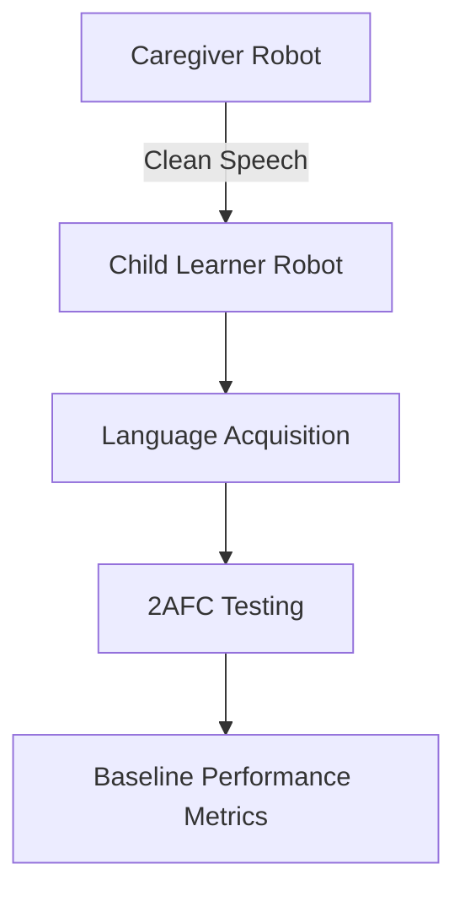
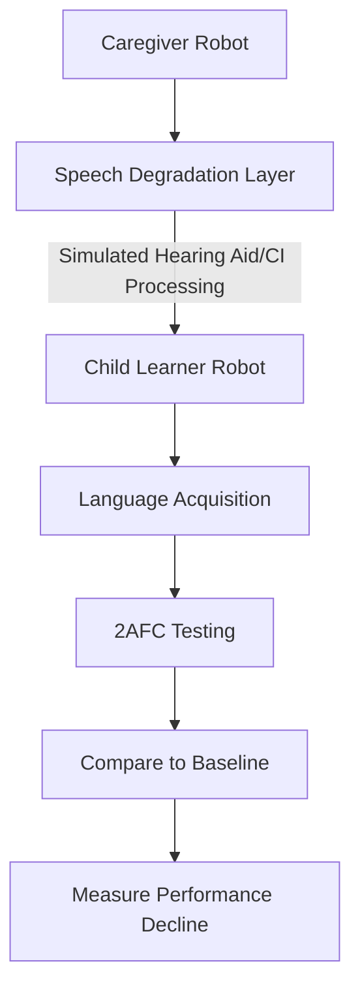

## September 2025 Update

I'm excited to share progress on a research project that sits at the intersection of artificial intelligence, speech processing, and developmental psychology. This work aims to understand how hearing loss affects early language acquisition in children by building AI systems that simulate the learning process.

## The Challenge

Children with hearing loss face a unique challenge during their critical language development years. They must learn spoken language while hearing through assistive devices like hearing aids and cochlear implants, which systematically degrade important aspects of human speech. These devices, while life-changing, don't perfectly reproduce the acoustic richness of natural speech that typically-hearing children experience.

The question we're investigating is: **How do these acoustic degradations impact the pathways through which children acquire language?**

## The Approach: Two Interacting AI Systems

To explore this question, I've developed a framework using two multi-modal AI systems that interact with each other, mimicking the caregiver-child dynamic:

### System 1: Caregiver Robot

The first system generates realistic child-directed speech:

This system combines:
- A **LoRA-fine-tuned Gemma language model** that generates authentic child-directed speech patterns
- A **Tortoise Text-to-Speech model** that produces the characteristic "sing-songy" prosody that caregivers naturally use when speaking to young children

### System 2: Child Learner Robot

The second system learns language from the caregiver's speech:

This system uses:
- **Meta's ImageBind architecture** to process both speech and visual information
- Multi-modal learning to connect spoken words with their corresponding objects, mirroring how children learn to map language to the world around them

## Research Design: Two Phases

### Phase 1: Baseline Language Acquisition

In the first phase, the Child Learner Robot acquires language by processing undegraded speech from the Caregiver Robot. We assess learning through a **2-alternative forced choice (2AFC) task** - the same paradigm used in developmental psychology research.

For example, when presented with images of a ball and an unfamiliar object, can the Child Robot correctly select the ball when hearing the word "ball"?

### Phase 2: Simulating Hearing Loss

The second phase introduces the critical manipulation: we apply speech synthesis techniques that simulate how speech sounds through assistive listening devices. This allows us to systematically degrade the acoustic signal in controlled ways.

We measure how these degradations affect the Child Robot's performance on the same language acquisition benchmarks.

## Hypothesis

Our central hypothesis is straightforward but has profound implications:

**As we systematically degrade the quality of caregiver speech to simulate hearing loss, the Child Learner Robot's performance on language acquisition tasks will decline.**

The pattern and magnitude of this decline will help us understand:
- Which acoustic features are most critical for early language learning
- How different types of hearing loss affect specific aspects of language acquisition
- What interventions might be most effective at different stages of development

## Why This Matters

This research advances our understanding of how hearing impairment affects learning pathways in several ways:

1. **Controlled Experiments**: Unlike human studies, we can precisely control acoustic degradations and run hundreds of learning scenarios
2. **Mechanism Understanding**: By observing which degradations most impact learning, we can identify the specific acoustic cues children rely on
3. **Intervention Design**: Insights from this work can shape early intervention strategies, helping clinicians optimize outcomes for children with hearing loss
4. **Device Development**: Understanding critical acoustic features can inform the next generation of assistive listening devices

## Technical Implementation Highlights

The project leverages several cutting-edge ML technologies:

- **LoRA (Low-Rank Adaptation)** for efficient fine-tuning of large language models on child-directed speech corpora
- **Tortoise TTS** for high-quality, expressive speech synthesis with prosodic control
- **ImageBind** for multi-modal representation learning that connects audio and visual modalities
- Custom speech processing pipelines to simulate various types of hearing device processing

## Next Steps

The immediate goals include:
- Completing the baseline Phase 1 experiments to establish performance metrics
- Implementing validated hearing device simulation models
- Running systematic Phase 2 experiments across different degradation levels
- Analyzing which acoustic features are most predictive of learning outcomes

This work represents a novel application of multi-modal AI to an important problem in developmental science. By creating AI systems that learn like children, we can gain insights that would be difficult or impossible to obtain through traditional research methods alone.

I'll continue to share updates as this research progresses. If you're interested in the technical details or want to discuss the approach, feel free to reach out!
